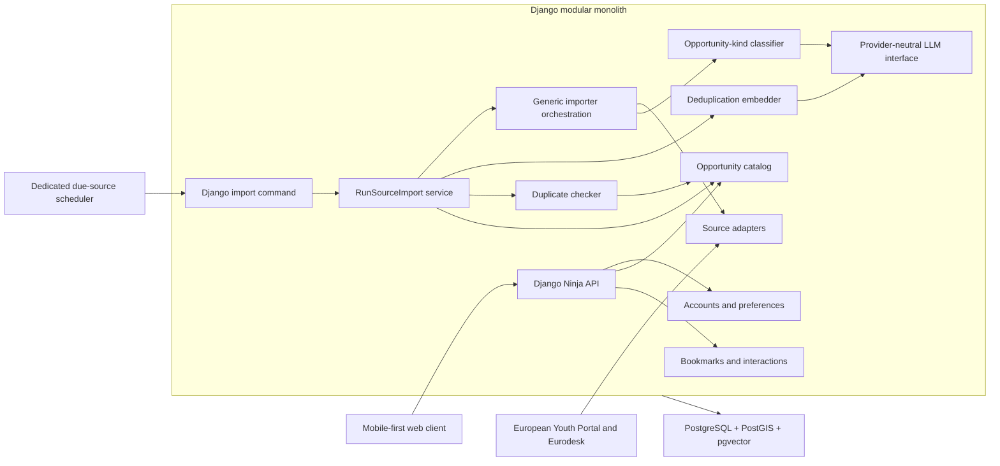

# CivilEU Backend Architecture and MVP Specification

**Status:** Accepted architecture baseline
**Last updated:** 2026-08-17
**Scope:** Backend only

## 1. Product vision

CivilEU aggregates democratic participation opportunities into a modern,
mobile-friendly application. It should help people find personally relevant
ways to participate in public and democratic life.

Current and potential catalog content includes:

- Events and recurring meetings.
- Workshops and dialogues.
- Volunteer opportunities.
- Demonstrations and campaign activities.
- Application-based learning and mobility programmes.

The long-term product may add organizer accounts, user-submitted opportunities,
attendance, waitlists, messaging, and other social features. Those capabilities
are explicitly outside the MVP.

The frontend is developed separately. This document covers the backend, data,
API, ingestion, authentication, and recommendation boundaries.

## 2. Engineering principles

1. **Prefer established frameworks.** Use maintained public frameworks for
   generic concerns such as HTTP APIs, validation, authentication, persistence,
   migrations, background work, and vector search.
2. **Build a modular monolith.** Keep business capabilities separated in code,
   but do not introduce network services until independent scaling or operation
   provides a measured benefit.
3. **Keep the MVP deliberately small.** The MVP database and accounts are
   disposable. Do not create unused organization, venue, occurrence, taxonomy,
   or social models merely for possible future requirements.
4. **Use clear boundaries rather than speculative abstractions.** Django models
   represent persistence, Pydantic models validate external and API data, and
   application services implement use cases.
5. **Prefer composition over inheritance.** Importers implement a small shared
   interface and emit one canonical candidate schema. Avoid deep base-class
   hierarchies and generic repository/service frameworks.
6. **Keep source-specific behavior inside import adapters.** Upstream field
   names, date quirks, identifiers, and categories must not leak into the
   catalog or API.
7. **Design all writes for idempotency.** Scheduled imports and future queued
   tasks may execute more than once.

## 3. Accepted technology choices

### MVP

- Python backend.
- Django 6.
- Django Ninja for the typed HTTP API and OpenAPI schema.
- Pydantic for API schemas, settings, source response validation, and canonical
  importer candidates.
- Django ORM and migrations.
- PostgreSQL.
- PostGIS for point storage and distance filtering.
- `django-allauth` for simple local MVP accounts and Django sessions.
- A dedicated scheduler container polling for sources due under their
  database-backed synchronization interval.
- No task broker, Celery workers, or recommendation engine in the MVP.

### MVP V2

- Local email/password accounts and Django sessions remain in use for this
  disposable release.
- One provider-neutral LLM interface shared by all LLM-backed project features,
  initially implemented with OpenAI structured responses.
- A generic typed LLM classifier specialized as a source-independent
  opportunity-kind classifier inside the ingestion/import pipeline.
- A second source and generic orchestration shared by both real adapters.
- One type-independent cross-source duplicate checker using deterministic,
  field-level, temporal/spatial, and semantic evidence.
- pgvector-backed, versioned content embeddings used only over an indexed,
  bounded duplicate-candidate pool.

### MVP V3

- Evolve the V2 generic importer and implement additional approved sources.
- Split ingestion into a format parsing stage and an LLM-assisted canonical
  normalization stage, separated by a provenance-preserving source-document
  contract.
- Treat target group as a canonical opportunity property, with provenance and
  confidence rules decided alongside the other canonical input fields.
- Source provenance, source-record/canonical representation, field merging,
  multi-source attribution, duplicate-row lifecycle, retention, review
  ownership, and multilingual matching calibration are decided at V3 entry.

### MVP V4

- Content-based semantic recommendation implemented as one coherent feature.
- Versioned recommendation-specific opportunity and user embeddings, separate
  from the ingestion duplicate-detection embedding purpose.
- V4 entry decisions cover the interest vocabulary, multilingual evaluation,
  recommendation model, ranking criteria, cold-start behavior, and whether
  recommendation workloads require additional task infrastructure.

### MVP V5

- Replace disposable local password authentication with OpenID Connect while
  preserving the boundary around local CivilEU user IDs and Django sessions.
- Provider, custom domain, issuer/subject mapping, passkeys, MFA, recovery,
  account linking, and client flows are decided at V5 entry.

### MVP V6–V8

- Scope is intentionally unassigned until the entry gate for each stage.
- Do not create placeholder modules or speculative models for these versions.

### MVP V9

- Production hardening of the host-agnostic container package: encrypted
  backups, restoration, host and persistent-storage resilience,
  privacy/retention operations, rate limiting, monitoring/alerting, capacity,
  recovery procedures, and service objectives.
- Concrete operational targets and mechanisms are decided at V9 entry.

### First release candidate

- The first RC follows accepted MVP V9; it is not a feature-planning stage.
- It starts from a fresh database for every table, including users. No MVP
  catalog, account, credential, session, preference, bookmark, interaction, or
  model-output data is migrated.
- The supported delivery remains the provider-neutral Docker/Compose service
  package.

## 4. High-level MVP architecture



The edge layer may later provide TLS termination, rate limiting, and caching.
It must not contain user filtering or recommendation logic.

## 5. MVP code boundaries

The initial Django project should be organized by business capability:

```text
accounts/
opportunities/
ingestion/
interactions/
config/
llm/
```

Each application owns its models, schemas, API router, services, and tests.

- `accounts` owns the local user, preferences, and authentication integration.
- `opportunities` owns catalog persistence, public catalog queries, and the
  source-independent duplicate-matching policy.
- `ingestion` owns sources, import runs, adapter registration, parsing, and
  canonical candidate generation, generic import orchestration, and classifier
  configuration.
- `interactions` owns bookmarks and behavioral events.
- `config` contains Django project configuration and composition only.
- `llm` owns provider-neutral structured-generation and embedding interfaces
  and provider implementations. Callers choose the model for their specific
  task.

There is no empty `recommendations` application in the MVP. It will be added as
one coherent module in MVP V4.

HTTP routes should call application/query services rather than containing ORM
and importer logic directly. Celery tasks added later will call the same
application services as management commands.

## 6. Authentication and user management

### 6.1 MVP authentication

The MVP uses `django-allauth` with local email/password accounts and Django
server-side sessions.

- Secure, `HttpOnly` session cookies are preferred for the browser client.
- Do not build a custom JWT or refresh-token system.
- Use a custom `AUTH_USER_MODEL` from the first migration, even if the model is
  initially minimal.
- Recommendation, catalog, and interaction code may depend on a local user ID,
  but must never depend on whether that user authenticated with a password,
  passkey, or external provider.

MVP accounts and all related personal data are discarded before the first RC.
No account or password migration from MVP is required; the RC starts with a
fresh database for all tables, including users.

### 6.2 MVP V5 authentication boundary

MVP V5 replaces disposable local registration and password login with OIDC.
Provider selection and the detailed passkey, MFA, recovery, account-linking,
custom-domain, browser, and native-client requirements are made at the V5 entry
gate rather than prescribed by the current MVP.

The expected browser boundary remains:

```text
Browser
  -> Django login endpoint
  -> Selected OIDC provider
  -> Django OIDC callback
  -> Local Django user mapping
  -> Django session cookie
```

This keeps `request.user` and all protected API routes stable while changing
only the login mechanism.

The V5 model maps `(issuer, subject)` from the selected identity provider to a
stable local CivilEU user ID. Provider subject identifiers must not become
foreign keys throughout the product domain.

OIDC standardizes application integration, but it does not guarantee portable
password hashes, MFA secrets, passkeys, or provider subject identifiers. A
possible later provider migration and the value of a stable custom
authentication domain must be considered when the V5 provider is selected.

Authentication determines who the user is. Fine-grained product authorization
remains inside CivilEU.

## 7. MVP persistence model

The MVP intentionally uses a small, flat model. Its data will be discarded
before the first RC rather than migrated into the later-stage schema.

### 7.1 Opportunity

One `Opportunity` model represents every publicly discoverable item.

```text
Opportunity
  id
  source_id
  external_id
  source_entity_id

  kind
  kind_classification_id
  title
  summary
  description
  language
  organizer_name

  starts_at
  starts_at_precision
  ends_at
  application_deadline_at
  application_deadline_at_precision
  temporal_timezone
  participation_mode

  country_code
  city
  address
  location

  action_kind
  action_url
  source_url
  action_url_hash
  source_url_hash
  image_url

  status
  source_updated_at
  last_seen_at
  consecutive_missing_syncs

  geocoding_provider
  geocoding_input_hash
  geocoding_status
  geocoding_metadata
  geocoding_last_attempt_at
  geocoded_at

  deduplication_embedding_id
  duplicate_of_id
  duplicate_status
  duplicate_algorithm_version
  duplicate_input_hash
  duplicate_checked_at

  raw_payload
  created_at
  updated_at
```

Required identity constraint:

```text
UNIQUE (source_id, external_id)
```

`location` is a PostGIS point suitable for distance queries. `starts_at`,
`ends_at`, and `application_deadline_at` are timezone-aware instants stored
through PostgreSQL `timestamptz`. A start/end pair describes the opportunity's
active or occurrence window. Opportunities may instead provide only an
application deadline or no known window. Precision and source timezone fields
preserve whether a source supplied a date or exact time for duplicate matching.

Every row remains owned by one source. A confidently matched duplicate points
through `duplicate_of_id` to the public canonical root; uncertain rows remain
public roots. Versioned embedding results and append-only `DuplicateDecision`
records retain reusable semantic data and explain why each decision was made.

Opportunity kinds are application-owned values rather than raw source strings:

```text
DIALOGUE
DEBATE
TALK
WORKSHOP
TRAINING
MEETUP
CONFERENCE
INFO_SESSION
CULTURAL_EVENT
COMPETITION
CEREMONY
RECRUITMENT
PROGRAMME
VOLUNTEERING
SCHOLARSHIP
GRANT
EXCHANGE
OTHER
```

There is no generic `EVENT` kind and no separate event-format dimension. The
classifier selects the most specific supported kind and uses `OTHER` as its
fallback. Participation mode and the primary action remain independent; for
example, a workshop may be online with `action_kind=APPLY`.

Primary action kinds:

```text
REGISTER
APPLY
SIGN
RESPOND
JOIN
LEARN_MORE
```

Participation modes:

```text
IN_PERSON
ONLINE
HYBRID
UNSPECIFIED
```

Publication statuses:

```text
PUBLISHED
WITHDRAWN
```

Temporal state is derived rather than stored:

- `ONGOING`: a start/end window contains `now`, or an opportunity without a
  window has a non-expired or unknown deadline.
- `UPCOMING`: `starts_at > now`.
- `ENDED`: the active window has ended, or a windowless opportunity's deadline
  has expired.

Ended opportunities remain stored and can be explicitly queried. Withdrawn
opportunities remain stored and are excluded from public catalog and detail
queries. A previously saved withdrawn opportunity may still appear in its
user's authenticated bookmark history.

The MVP does not contain separate organization, venue, occurrence, taxonomy,
media, attribution, or source-record tables. These relationships will be added
only when their owning MVP stage establishes concrete requirements.

### 7.2 Source

```text
Source
  id
  name
  adapter_key
  configuration
  sync_interval
  enabled

  attribution_name
  attribution_text
  attribution_url

  last_success_at
  created_at
  updated_at
```

The initial source uses:

```text
adapter_key = "eu_youth_events.v1"
sync_interval = 6 hours
configuration = {
  "api_base_url": "https://youth.europa.eu/api/rest/eyp/v1",
  "search_path": "search_en",
  "portal_base_url": "https://youth.europa.eu"
}
```

The approved second adapter is seeded enabled with plain Eurodesk attribution:

```text
adapter_key = "eurodesk_learning.v1"
sync_interval = 6 hours
enabled = true
configuration = {
  "page_url": "https://programmes.eurodesk.eu/learning",
  "search_url": "https://programmes.eurodesk.eu/search",
  "subcategories": [
    "scholarships",
    "youth exchanges",
    "training courses",
    "travel grants"
  ]
}
```

The database stores a stable adapter key, never a Python module or class path.
A code-owned registry resolves the adapter:

```text
"eu_youth_events.v1" -> EUYouthEventsImporter
"eurodesk_learning.v1" -> EurodeskLearningImporter
```

Source-specific endpoints, paths, attribution, enablement, and schedules are
database-owned configuration. They are not Django settings or environment
variables. Each adapter validates its own `configuration` schema before making
a request. The sync command reads all enabled `Source` rows in stable order,
resolves each `adapter_key`, and passes the row to that importer.

The narrowly scoped bootstrap command creates missing source rows only. It does
not overwrite endpoint or attribution changes made by an operator through the
restricted admin. A data migration fills newly required configuration keys for
rows created by earlier releases.

### 7.3 ImportRun

```text
ImportRun
  id
  source_id
  status
  started_at
  finished_at

  records_received
  opportunities_created
  opportunities_updated
  records_unchanged
  records_ignored
  records_rejected
  records_missing

  classifications_succeeded
  classifications_cached
  classifications_failed

  error_summary
```

`ImportRun` is the operational source of truth. Process logs alone are not
sufficient for import monitoring.

### 7.4 ClassificationResult

```text
ClassificationResult
  classifier_key
  classifier_version
  input_hash
  provider_key
  model_key
  provider_response_id
  output
  input_tokens
  output_tokens
  created_at

UNIQUE (classifier_key, classifier_version, input_hash)
```

The cache identity is derived only from normalized, deterministic source
content. Provider/model selection and LLM-generated output are audit metadata,
not hash inputs. Changing a provider or model therefore does not implicitly
reclassify existing content; a later manual process may do so if required.

### 7.5 UserProfile

```text
UserProfile
  user_id
  timezone
  location
  travel_radius_meters
  participation_modes
  interest_codes
```

- `timezone` is an IANA timezone such as `Europe/Berlin`, not a fixed UTC
  offset.
- `location` is a PostGIS point.
- `participation_modes` and `interest_codes` may be PostgreSQL string arrays
  validated by API schemas in the disposable MVP.
- Interest values are stored for onboarding compatibility but do not influence
  the MVP catalog.

The backend exposes preference values. The frontend decides how and when to ask
for them.

### 7.6 Bookmark

```text
Bookmark
  user_id
  opportunity_id
  created_at

UNIQUE (user_id, opportunity_id)
```

`SAVED` is the only explicit MVP bookmark state. Source withdrawal does not
silently remove a bookmark: authenticated bookmark history may retain the
withdrawn opportunity, and the frontend decides whether to hide it, mark it
unavailable, or offer removal. New bookmarks still require a currently public
canonical opportunity.

### 7.7 Interaction

```text
Interaction
  id
  user_id
  opportunity_id
  interaction_type
  occurred_at
  context
```

MVP interaction types:

```text
IMPRESSION
OPEN
SAVE
UNSAVE
EXTERNAL_ACTION_CLICK
```

An external action click is not a confirmed registration or attendance event.
The MVP has no native registration system.

`user_id` may be null for anonymous interactions. Session, feed position, and
algorithm/version context may be placed in a small JSON context object.

## 8. Sources and generic importer

### 8.1 Source

The baseline source is the observed European Youth Portal Events API described
by `eu-youth-events-openapi.yaml`. Eurodesk Learning is the second implemented
adapter. Its reuse has been approved and its database row is enabled by default.

The API is undocumented and internal. It may change without notice, so the
adapter must be tolerant of additional upstream fields while remaining strict
when creating canonical opportunity candidates.

### 8.2 Import pipeline

```text
Dedicated scheduler container
  -> Django management command
  -> RunSourceImport
  -> adapter registry
  -> source adapter fetch and response validation
  -> source-specific canonical mapping
  -> GenericImporter
       -> source-independent OpportunityKindClassifier
            -> caller-selected model through LLMProvider
  -> complete OpportunityCandidate validation
  -> idempotent Opportunity upsert
  -> ImportRun completion
```

Source-specific response types must not be used by catalog, classifier, or API
code. Every adapter emits the same strict Pydantic `OpportunityCandidate`.

### 8.3 Field mapping

| Upstream field | MVP destination | Rule |
| --- | --- | --- |
| `_source.uuid`, `language` | `external_id` | Stable `uuid:language` identity; translations share UUIDs |
| `_id`, `identifier` | `raw_payload` | Retain for diagnostics |
| `title` | `title` | Required |
| `summary` | `summary` | Plain summary |
| `body` | `description` | Remove script/style content and sanitize HTML before persistence |
| Normalized content | `kind` | Shared classifier selects one flat kind; `OTHER` is the safe fallback |
| `start_date` | `starts_at` | Interpret as UTC despite missing `Z` |
| `end_date` | `ends_at` | Interpret as UTC despite missing `Z` |
| `online`, `venues` | `participation_mode` | Online plus venue is hybrid |
| `venues[0].country.iso` | `country_code` | Normalize upstream `EL` to ISO `GR` |
| `venues[0]` | Flat location fields | Preserve all venues in `raw_payload` |
| Geocoder result | `location` | OpenCage is the first replaceable provider |
| Constant | `organizer_name` | Nullable because the source has no organizer field |
| `online_location.url`, `url` | Action and source URLs | Resolve relative portal URLs |
| `language` | `language` | Retain every source language |
| `updated` | `source_updated_at` | Unix timestamp from source |
| `styled_images` | `image_url` | Prefer 1260x630, 400x220, eyp_large, then large |
| Full accepted record | `raw_payload` | Support diagnosis and remapping |

Every visible source record satisfying the universal opportunity invariants is
classified from its normalized content. Section values are retained in
`raw_payload`; they are not used as an unverified taxonomy. The generic importer
preserves `OTHER` when classification is unavailable or not confident.

### 8.4 Eurodesk Learning mapping

The Eurodesk adapter uses the public Learning page to establish its browser
session, then requests the page's filtered search response. It validates the
reported unique programme count before returning localized records.

| Source value | Canonical destination | Rule |
| --- | --- | --- |
| Programme ID plus national edition | `external_id` | Stable localized identity |
| Localized title/body | Content fields | Sanitize public description; preserve raw template HTML |
| National edition | `language` | Map edition to actual content language, e.g. `uk` edition to English and `ua` edition to Ukrainian |
| Normalized content | `kind` | Same shared kind classifier as every other source |
| Application deadline | `application_deadline_at` | Parse end-of-day UTC; occurrence times stay null |
| Primary programme link | `action_url` | `action_kind=APPLY` |
| Category/subcategory/target | `raw_payload` | Retain for later provenance and taxonomy work |

The adapter currently maps all configured Learning subcategories. Its approved
row is seeded enabled and the public API attributes its records to Eurodesk.

### 8.5 UTC policy

For this specific source, `start_date` and `end_date` are UTC instants even
though their strings omit the `Z` suffix. The source adapter must explicitly
attach UTC before creating the canonical candidate.

This rule is source-specific. Future importers must parse explicit timezone
information or define their own documented conversion policy. The canonical
model and public API always use timezone-aware instants. The browser performs
display conversion using the user's timezone.

### 8.6 Synchronization behavior

- Store each source synchronization interval in its `Source` row. The current
  European Youth Portal Events interval is six hours.
- Obtain the count, reject totals over 1,000, then fetch exactly that bounded
  count in one request. The source exposes no unique sort tiebreaker, so offset
  pages can overlap when event dates tie and cannot be used for a complete sync.
- Use `(source_id, external_id)` for idempotent upsert.
- Use the source update timestamp and/or raw-payload hash to detect changes.
- A run is complete only after all expected pages are successfully fetched and
  validated.
- A failed or incomplete run must never mark records missing or withdrawn.
- After three consecutive successful complete runs in which an existing record
  is absent, mark that opportunity `WITHDRAWN`.
- Retain all ended and withdrawn rows rather than deleting them.
- Protect each source with a PostgreSQL/advisory lock so overlapping scheduler
  invocations cannot import the same source concurrently.
- Use HTTP timeouts and a bounded number of immediate retries with exponential
  backoff, respect `Retry-After`, and pace requests at no more than one per
  second for the initial source.
- The management command exits non-zero on terminal failure.

Geocoding is best-effort enrichment after a successful source upsert. A
replaceable provider interface is used with OpenCage as the first provider.
Only records with a country and usable city or street are geocoded. Successful
and terminal no-match outcomes are cached by provider and normalized input;
transient failures may be retried. A result is accepted only when its country
matches the source venue and provider confidence is at least 7/10. Geocoding
failure does not make an otherwise complete source import fail.

### 8.7 Attribution and content rights

Approval has been obtained for the European Youth Portal Events source,
including text and images, subject to credit on the opportunity details page.
It is credited as `European Youth Portal` with a link to its events catalog.

Approval has also been obtained for Eurodesk Learning. Its opportunities are
credited with `Source: Eurodesk` and link to the Opportunity Finder Learning
catalog.

Each future source must be checked for reuse rights before activation. Public
API accessibility alone must not be treated as permission to republish text or
images.

### 8.8 MVP V2 generic importer and classification

MVP V2 adds one generic typed LLM classifier framework. A concrete
`OpportunityKindClassifier` configures it for the flat opportunity taxonomy and
is not customized per source.

```text
source response
  -> source-specific normalization
  -> generic importer orchestration
       -> source-independent OpportunityKindClassifier
            -> provider-neutral LLMProvider
       -> source-independent OpportunityDeduplicationEmbedder
            -> provider-neutral EmbeddingProvider
  -> fully populated canonical OpportunityCandidate
  -> shared transactional catalog persistence
       -> source-independent DuplicateChecker
```

The generic classifier is parameterized by typed input and output contracts.
The opportunity-kind specialization supplies the strict response schema,
canonical labels, prompt version, confidence threshold, and fallback. Its deterministic
input contains only normalized title, summary, sanitized description, and
language—never source-specific response types or LLM-generated values.

The `LLMProvider` owns provider API differences and structured-output calls.
Provider credentials remain secret environment configuration; classifier and
importer code depend only on the provider interface. The first implementation
uses OpenAI's Responses API. The caller supplies the model for each task;
opportunity-kind classification defaults to `gpt-5.4-nano`. Later LLM-backed
features reuse this interface rather than adding provider clients directly.

Classification must preserve `OTHER` for missing, conflicting,
low-confidence, provider-error, or invalid-output cases. Successful results are
cached by `(classifier_key, classifier_version, deterministic_input_hash)` and
record model/provider audit data, usage, confidence, and reason codes. Provider
or model changes do not automatically reclassify existing rows. Provider
failures are not cached and do not fail an otherwise valid source import.

Both real adapters keep fetching and normalization source-specific, while
classification orchestration and database persistence are shared. Complete
fetch validation remains each adapter's responsibility because upstream count
and pagination contracts differ. Transactional upsert, missing counters, and
withdrawal behavior cannot diverge between sources.

### 8.9 MVP V2 duplicate detection

Every new or materially changed opportunity is checked by the same algorithm,
regardless of its classified kind. Candidate rows are the union of same source
entity, normalized URL, nearby occurrence/deadline, and similar-title blocks.
Occurrence windows and application deadlines expand one temporal candidate
pool rather than intersecting or partitioning it, so differently classified or
differently modelled copies can still meet.

The bounded pool is scored with normalized title, semantic content, temporal,
location, and organizer evidence. High-confidence matches link to a canonical
source row and are hidden from the public catalog; uncertain cases remain
public. Hard temporal, geographic, and title-year contradictions prevent an
automatic merge. Missing embedding credentials or provider failure removes
only semantic evidence and does not fail the import.

The complete current policy, thresholds, storage lifecycle, operations, and V3
decision inputs are specified in `DUPLICATE_DETECTION.md`.

## 9. MVP public API

The initial API surface is:

```text
GET /v1/opportunities
GET /v1/opportunities/{id}

GET    /v1/bookmarks
PUT    /v1/bookmarks/{opportunity_id}
DELETE /v1/bookmarks/{opportunity_id}

GET   /v1/users/me/preferences
PATCH /v1/users/me/preferences

POST /v1/interactions
```

Authentication endpoints are provided through the selected `django-allauth`
headless/session integration.

### 9.1 Catalog filters

```text
kind
country
city
language
source
action_kind
query
latitude + longitude + radius
participation_mode
starts_after
starts_before
ends_after
ends_before
deadline_after
deadline_before
temporal_status
has_date
limit
offset
```

### 9.2 Catalog behavior

- Anonymous and authenticated users may browse.
- Authentication is required for preferences and bookmarks.
- Default results contain ongoing and upcoming opportunities.
- Ended opportunities require an explicit `temporal_status=ended` filter.
- Withdrawn opportunities are excluded from public catalog and detail routes.
  Previously saved withdrawn opportunities may remain in the authenticated
  bookmarks response; the frontend owns their presentation.
- MVP pagination uses bounded `limit` and `offset`.
- Default deterministic ordering is ongoing first, followed by upcoming
  events ordered by `starts_at` and open non-events ordered by application
  deadline. Distance may be used as a tie-breaker when available.
- Saved profile location, radius, and participation mode may be applied as
  explicit client-supplied filters. The catalog does not silently apply stored
  preferences. This is not a recommendation algorithm.
- A distance filter returns geocoded in-person records within range and all
  online or hybrid records. Ungeocoded in-person records remain browseable but
  are excluded from distance-filtered results.

The API must return explicit RFC 3339 timestamps such as
`2019-12-13T09:00:00Z`.

## 10. MVP discovery and recommendation boundary

The MVP has no recommendation algorithm and no topic classification.
Single-label opportunity-kind classification and semantic duplicate detection
are ingestion concerns, not recommendation features.

It does not:

- Create user vectors or recommendation-specific opportunity vectors.
- Use duplicate-detection embeddings to rank or personalize opportunities.
- Assign political topic tags to opportunities.
- Infer preferences from behavior.
- Rank results by predicted relevance.

It does support hard filters, deterministic ordering, preference storage,
bookmarks, and interaction capture.

Capturing impressions, opens, saves, unsaves, and external-action clicks in the
MVP validates the behavioral event pipeline. MVP data is disposable and is not
assumed to become production training history.

## 11. MVP V4 recommendation implementation

Recommendation will be implemented in one coherent sweep rather than as unused
MVP scaffolding.

Multi-label topic/interest tagging belongs in this recommendation release. It
must not be conflated with the single primary opportunity-kind classifier.

### 11.1 Candidate selection

Apply hard constraints before semantic ranking:

- Published and not ended.
- Requested time window.
- Geographic radius unless online.
- Participation mode.
- Any explicit user exclusions.

### 11.2 Opportunity representation

Create recommendation-specific semantic embeddings from cleaned content:

```text
title + summary + description
  -> selected embedding model
  -> versioned OpportunityEmbedding
```

The selected model must eventually support the languages required by the EU
catalog. The MVP retains every language exposed by the source and labels it
explicitly; interfaces must not assume English-only or Germany-only data.
These vectors may share the generic embedding provider and pgvector
infrastructure, but must use their own versioned purpose and evaluation rather
than silently reusing ingestion duplicate-detection embeddings.

### 11.3 User representation

The cold-start user representation is derived from natural-language
descriptions of their explicitly selected interests. It can later be updated
from weighted behavior:

- `OPEN`: weak positive.
- `SAVE`: strong positive.
- `EXTERNAL_ACTION_CLICK`: stronger positive, but not confirmed participation.
- `HIDE`, when introduced: strong negative.
- `IMPRESSION`: neutral by itself.

### 11.4 Versioned vector storage

Embeddings must not be placed directly on `Opportunity` or `User`.

```text
OpportunityEmbedding
  opportunity_id
  model_key
  model_version
  embedding
  created_at
```

```text
UserEmbedding
  user_id
  model_key
  model_version
  embedding
  created_at
```

This permits old and new embedding versions to coexist while recomputation is
in progress.

### 11.5 Ranking

The MVP V4 ranker may combine:

```text
semantic content similarity
explicit-interest similarity
distance utility
time utility
participation-mode preference
source quality
behavior-derived preference
diversity and exploration
```

Every feed request and interaction should record an algorithm version. Ranking
should eventually return explanation/reason codes suitable for debugging and
user-facing transparency.

## 12. Background execution horizons

### 12.1 MVP

```text
Dedicated scheduler container
  -> management command
  -> RunSourceImport application service
  -> source adapter
```

The scheduler container uses the same immutable application image as the web
and one-shot migration containers. It runs independently from Gunicorn, polls
immediately and on a short configured interval, and imports only sources due
under their database-backed `sync_interval`. It exposes a database-backed
freshness health check. No Celery, RabbitMQ, or Redis is required for one small
deterministic import.

### 12.2 Stage-gated scaling threshold

A task system becomes justified when several sources must run concurrently,
LLM parsing takes substantial time, embeddings must be regenerated, API calls
enqueue work, or durable retry scheduling is required.

```text
Scheduler
  -> task broker
  -> Celery workers
       - deterministic-import queue
       - LLM-extraction queue
       - enrichment queue
       - embedding queue
```

Requirements:

- Celery tasks remain thin wrappers around application services.
- Separate queues and concurrency limits isolate workloads.
- Source-specific rate limits are supported.
- Retries use exponential backoff and jitter.
- Terminal failures remain inspectable.
- Tasks remain idempotent because delivery is at least once.
- `ImportRun`, not the Celery result backend, remains operational truth.

If V3 import evidence justifies a broker, its entry gate evaluates options such
as:

- RabbitMQ for stronger dedicated queue semantics and routing.
- Redis if deployment simplicity is more important and its behavior is
  sufficient for the measured workload.

## 13. MVP V3 two-stage importer and source expansion boundary

MVP V2 has two source-specific adapters behind the shared `GenericImporter`
foundation and persistence boundary. MVP V3 evolves that foundation while
implementing additional approved sources. The V3 importer has two explicit
stages:

```text
source
  -> parser/reader (API | website/HTML | RSS | ICS | email | other approved format)
  -> provenance-preserving readable source document
  -> LLM-assisted canonical normalizer
  -> validated OpportunityCandidate
```

The parser/reader owns transport, format decoding, deterministic cleanup, and
source identity. It must retain the original payload and enough provenance to
reproduce or audit every extracted document. Source-specific behavior stays at
this boundary rather than leaking into canonical persistence.

The LLM-assisted normalizer interprets the readable document and maps it into
CivilEU's canonical schema. At the V3 entry gate, decide whether and when it may
translate content to English, infer dates and time zones from prose, normalize
locations, identify an opportunity's target group, or derive other fields that
are not explicitly structured by the source. Target group is a property of the
opportunity, not a recommendation-only label. Original-language content and
provenance must remain available even if an English canonical representation is
produced.

LLM normalization must:

- Emit the same strict Pydantic `OpportunityCandidate` as deterministic
  importers.
- Record input hash, model, prompt/parser version, output, and errors.
- Never bypass deterministic normalization and validation.
- Treat unknown or low-confidence structures as rejected rather than silently
  publishing them.
- Preserve source provenance.
- Distinguish explicit source facts from inferred or translated values.

## 14. Later data-model horizons

The following structures are intentionally not part of the disposable MVP:

- `Organization` and organizer accounts.
- `Venue` or reusable location entities.
- `OpportunityOccurrence` for recurring or multi-session events.
- Attendance and waitlists.
- User-submitted opportunities.
- Moderation workflows.
- Canonical taxonomy entities.
- Native registration or ticketing.
- Social graphs, messaging, and attendee visibility.

Source records, canonical opportunities, multi-source provenance, field-level
merging, attribution, duplicate review, and retention are specifically owned by
MVP V3. The remaining structures are designed only when a later stage assigns
them concrete requirements. The first RC database is created fresh after MVP
V9 and is not constrained by disposable MVP data.

## 15. Minimum verification requirements

The MVP should include automated tests for:

- Parsing the API's timezone-less date strings as UTC.
- Multilingual and fallback-language event records.
- First-venue flattening and preservation of every venue in `raw_payload`.
- Participation-mode and opportunity-kind fallback mapping.
- Sanitizing imported HTML.
- Rejecting invalid records without creating opportunities.
- Normalizing `EL` to `GR`.
- Complete-fetch count and duplicate-identity failures.
- Idempotently rerunning the same import.
- Updating a changed upstream record without duplication.
- Not incrementing missing counters after failed/incomplete imports.
- Withdrawing only after three successful complete misses.
- Preventing overlapping imports for the same source.
- Database-owned source configuration and non-overwriting source seeding.
- Geocoding success, rejection, caching, provider changes, and transient failure.
- Radius behavior for geocoded, ungeocoded, online, and hybrid records.
- Public filtering of ongoing, upcoming, ended, and withdrawn records.
- Flat opportunity-kind validation and filtering.
- Bookmark uniqueness and authentication.
- Retention of previously saved withdrawn opportunities in authenticated
  bookmark history, including an explicit publication status for frontend
  presentation.
- Interaction batching and automatic save/unsave events.
- Preference validation, including IANA timezone values.
- Public API timestamps containing an explicit UTC offset or `Z`.
- Scheduler repetition and stale-import health detection.
- Caller-selected LLM models and strict structured output.
- Opportunity-kind cache reuse based only on deterministic normalized source input.
- Classification fallback on low confidence, invalid output, missing
  credentials, and provider failure without failing the source import.
- Classification audit linkage and import-run success/cache/failure counters.
- Eurodesk localized-edition language mapping, application deadlines, HTML
  sanitization, and complete programme-count validation.
- Current/ended public filtering for deadline-based non-events.
- Candidate-block unions across source identity, URL, title, occurrence, and
  deadline anchors without opportunity-kind gating.
- Weighted duplicate decisions, missing-evidence coverage, deterministic
  identities, hard contradictions, uncertain publication, and algorithm audit.
- Cached/batched embeddings and graceful matching when vectors are unavailable.
- Canonical-only catalog/bookmark behavior, concurrent cross-source checks, and
  active duplicate promotion after canonical withdrawal.

Use captured source responses as importer fixtures so tests do not depend on the
live undocumented API.

## 16. Stage-entry decisions

Decisions are made at the beginning of the MVP stage that owns them, using the
evidence available then:

1. **MVP V3:** additional approved sources and attribution, parser/source-
   document/LLM-normalizer boundaries, translation and date-inference policy,
   coherent canonical inputs including target group as an opportunity property,
   source/canonical storage, provenance, field merging, multi-source
   attribution, duplicate review/lifecycle/retention, and multilingual matching
   calibration, plus any importer task infrastructure justified by measured
   workload.
2. **MVP V4:** interest vocabulary and onboarding semantics, multilingual
   recommendation evaluation, recommendation embedding/model strategy, ranking
   criteria, cold-start behavior, and any additional task infrastructure
   justified by recommendation workloads.
3. **MVP V5:** OIDC provider and custom domain, issuer/subject mapping,
   passkeys, MFA, recovery, account linking, and client flows.
4. **MVP V6–V8:** scope itself, followed by the decisions belonging to that
   scope. These versions intentionally have no placeholder implementation.
5. **MVP V9:** backup and restore targets, hosting and storage resilience,
   privacy/retention operations, rate limits, monitoring and alert ownership,
   capacity, recovery procedures, and service objectives.

The delivery model is not open: CivilEU remains a host-agnostic Docker/Compose
package. The first RC follows MVP V9 and begins with a fresh database for every
table, including users. See the [roadmap](ROADMAP.md) and
[decision records](docs/decisions/README.md).

## 17. Reference documentation

- [Django documentation](https://docs.djangoproject.com/en/6.0/)
- [Django Ninja documentation](https://django-ninja.dev/)
- [django-allauth documentation](https://docs.allauth.org/en/latest/)
- [PostgreSQL documentation](https://www.postgresql.org/docs/current/)
- [PostGIS documentation](https://postgis.net/documentation/)
- [pgvector](https://github.com/pgvector/pgvector)
- [Celery documentation](https://docs.celeryq.dev/en/stable/)
- [OpenAI GPT-5.4 nano model](https://developers.openai.com/api/docs/models/gpt-5.4-nano)
- [OpenAI structured outputs](https://developers.openai.com/api/docs/guides/structured-outputs)
- [Eurodesk Opportunity Finder — Learning](https://programmes.eurodesk.eu/learning)
